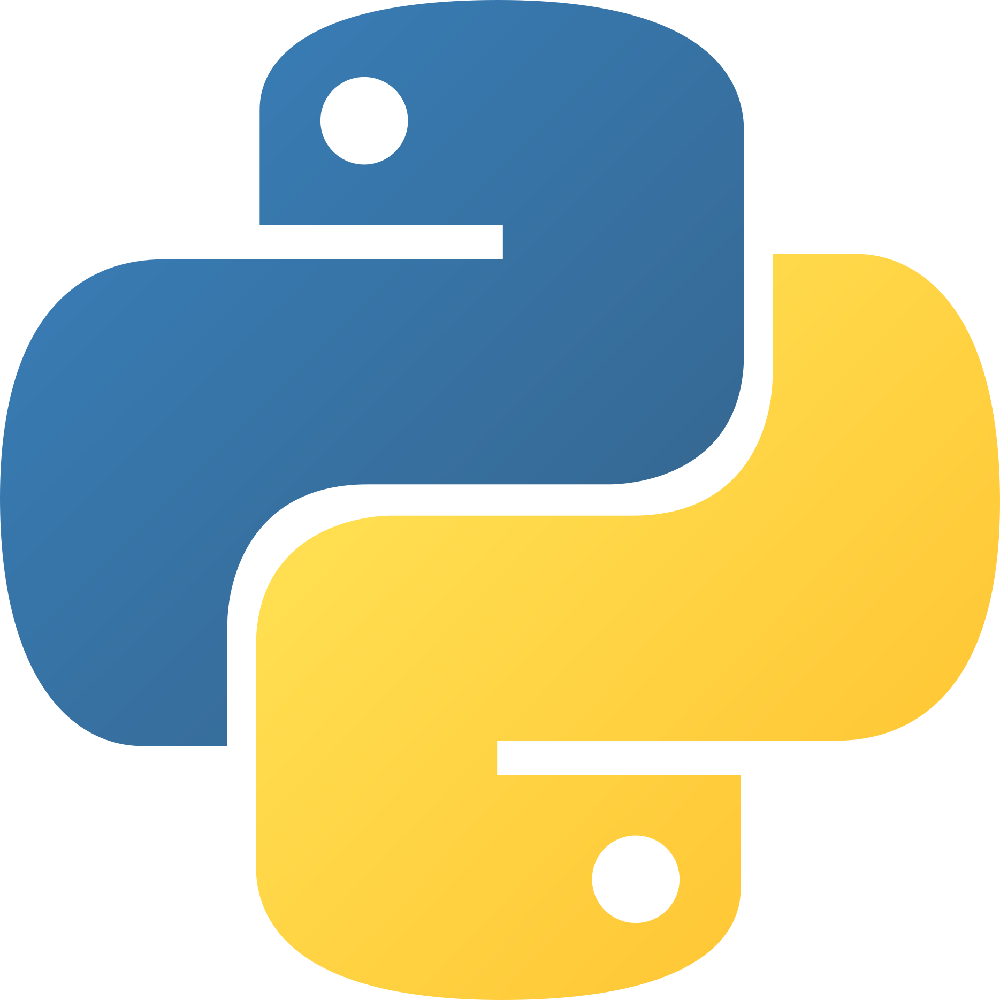

### Hi there 👋 I'm Zaky

Experienced Frontend Developer who builds web-based applications using modern technologies such as Vue.js and React.js. Focusing on user needs by prioritizing responsiveness, scalability, maintainability, and performance to deliver a meaningful user experience. I thoroughly enjoy the process of slicing UI designs into code and turning them into reliable digital products. I am still learning and developing my skills to grow as a professional software developer.

- 📫 How to reach me: <mamurzakynurrokhman@gmail.com>

### Favorite Programming Language

 
 

### Favorite Framework & Tools

 
 

### GitHub Statistics

### Holopin Badges

